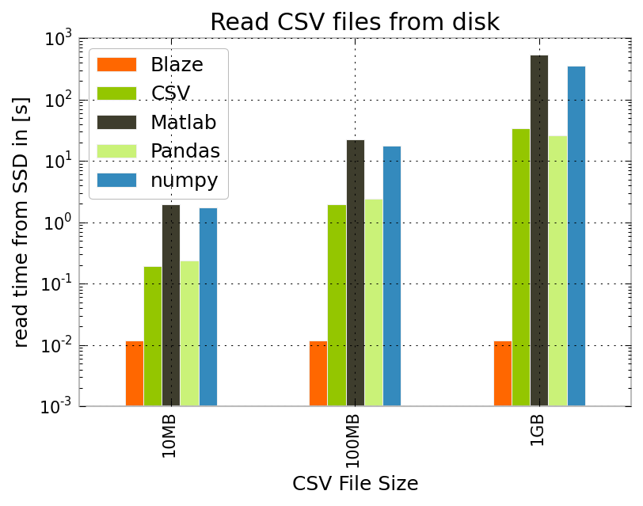

ReadLargeCSVs
=============

How to efficiently read large .csv files on your notebook

Repo for this blogpost: [Wie man große Dateien auch auf einem kleinen Notebook bearbeitet](http://mechlab-engineering.de/2015/01/wie-man-grosse-dateien-auch-auf-einem-kleinen-notebook-bearbeitet/)

Files:

1. generateRandomSampleData - to generate some sample data up to specified file size
2. no-itsnotBigData - to read the csv files
3. readCSVtimings - to generate diagrams with read timings

